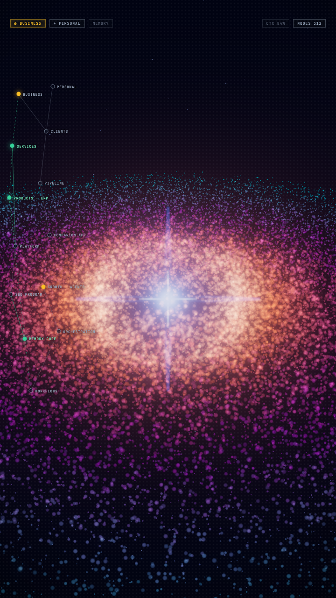

# Claude OS — Reel

Sosyal medyada dolaşan **"POV: It's 3 AM but you have Claude Max"** reel'indeki 3D "AI second brain / komuta merkezi" görselinin çalışan, açık kaynak klonu.

Three.js partikül nebulası + bloom + node graph overlay + HUD. **Tek dosya (`index.html`), build gerekmez.**

👉 **Canlı demo:** https://eneslexi.github.io/claude-os-reel/



---

## Hızlı başlangıç

```bash
git clone https://github.com/Eneslexi/claude-os-reel.git
cd claude-os-reel
python3 -m http.server 8777
# tarayıcıda aç: http://localhost:8777/
```

Ya da hiç indirmeden **canlı demoyu** aç (link aşağıda). İçerik/kayıt için Chrome penceresini 9:16 yapıp **Cmd+Shift+5** ile ekran kaydı al.

---

## Nasıl yapıldı — adım adım

Toplam ~350 satır tek dosya. Mantık 6 katman:

### 1) Sahne iskeleti (Three.js)
- `WebGLRenderer` + `PerspectiveCamera` + `Scene`.
- `ACESFilmicToneMapping` + `toneMappingExposure = 0.5` → parlak partiküllerin beyaza patlamasını engeller (en kritik ayar).
- Sahneyi 9:16 bir `#stage` kutusuna oturttuk ki reel formatında dursun.

### 2) Yıldız alanı (arka plan derinliği)
- 2200 noktalık bir `THREE.Points`, geniş bir küpe rastgele dağıtılmış, `AdditiveBlending`.

### 3) Akresyon diski / nebula (asıl efekt)
- **34.000 partikül** bir diske yerleştirildi (silindirik: `r`, `θ`, ince `y` kalınlığı).
- Merkeze doğru yoğunlaşma: `r = 3 + pow(random, 1.25) * R` → ortada net bir "göz" boşluğu.
- Renk yarıçapa göre geçiş: **sıcak çekirdek → turuncu → magenta → teal** (`cInner→cHot→cMid→cOut`).
- **Diferansiyel dönüş = spiral hissi:** dönüş hızını CPU değil **vertex shader** yapıyor. İç halkalar dıştan daha hızlı döner:
  ```glsl
  float speed = 0.55 / (aRadius*0.16 + 0.6);   // ice dogru hizli
  float a = aAngle + uTime * speed;            // spiral
  ```
- Her partikül yumuşak yuvarlak (fragment shader'da `gl_PointCoord` ile daire), `AdditiveBlending`, `depthWrite=false`.

### 4) Merkez spark (Claude yıldızı)
- Canvas'a radial gradient + 4 kollu yıldız çizildi, `CanvasTexture` olarak bir `Sprite`'a bindirildi.
- Nefes alır gibi `pulse` ile ölçeklenir. Arkasında mavi bir `glow` sprite'ı.

### 5) Bloom (o ışıltı)
- `EffectComposer` → `RenderPass` → **`UnrealBloomPass`** → `OutputPass`.
- `strength 0.55, radius 0.6, threshold 0.22`. Threshold'u 0 yaparsan her şey patlar; 0.22 sadece parlak çekirdeği bloom'lar.

### 6) UI overlay'leri (HTML/CSS, 3D değil)
- **Sol node graph:** `NODES` + `EDGES` dizileri. Node'lar `<div>`, bağlantılar `<svg><line>`. Kesikli çizgiler + yeşil "aktif" node'lar.
- **Üst HUD:** monospace `JetBrains Mono`, canlı saat (`BRIEFING · LIVE ...`).
- **Grain + vignette:** hafif film dokusu.

### Bonus) Otomatik MP4 render
`?t=SANIYE` parametresi animasyonu o karede **dondurur**. Headless Chrome ile `t=0..6` arası 72 kare alınıp `ffmpeg` ile `reel.mp4` üretildi. (En iyi kalite gerçek GPU'lu Chrome'da ekran kaydı.)

---

## Kendine göre uyarla (`index.html` içinde)

| Ne | Nerede |
|---|---|
| Node etiketleri / bağlantılar | `const NODES = [...]`, `const EDGES = [...]` |
| Nebula renkleri | `cInner / cHot / cMid / cOut` |
| Partikül sayısı / disk boyutu | `COUNT`, `R` |
| Parlaklık | `toneMappingExposure`, `bloom.strength` |
| Üste yazı | `<div class="pov">...</div>` (HTML'de yorumda) |

---

## Teknoloji
Three.js (r160, CDN importmap) · WebGL2 · UnrealBloomPass · vanilla JS/HTML/CSS. Framework yok, bağımlılık yok.

Bruno Simon'ın [Three.js Journey](https://threejs-journey.com) "galaxy" dersinden ilham alır.

## Lisans
MIT — dilediğin gibi kullan, çatalla, değiştir.
